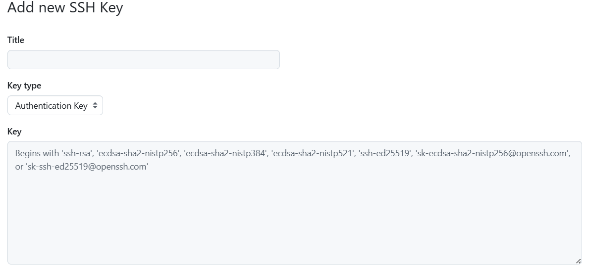
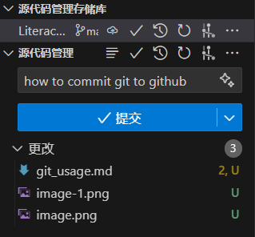
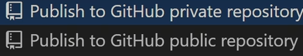
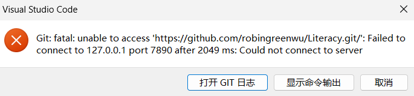

# 在vscode中远程push github仓库的简单步骤

## 一、软件安装

### 1、安装git

网址：[git官网](https://git-scm.com/)

检查是否安装成功：打开命令提示符 (Win + R 后输入cmd)，输入`git --version`

如果看到类似 `git version 2.x.x` 的输出，则表示安装成功。

### 2、安装vscode

## 二、SSH配置步骤

https协议由于GitHub安全保护机制非常难连，所以我们一般使用ssh密钥对进行连接

### 1、配置个人信息

在终端命令行输入指令：`git config --global user.name "你的名字"`

在终端命令行输入指令：`git config --global user.email "你的邮箱"`

### 2、生成SSH密钥

在终端命令行输入指令：`ssh-keygen -t rsa -C "你的邮箱"`

### 3、添加公钥到远程仓库

在生成SSH密钥后，在用户目录下会出现.ssh文件，例如`C:\Users\xxx\.ssh`,.ssh文件中的id_rsa.pub是ssh的密钥，用记事本编辑打开复制。

打开Github，进⼊ **Settings > SSH and GPG keys > New SSH key**，粘贴公钥并保存至**Key**中。(title可以随便取)

### 4、测试连接

在终端命令行输入指令：`ssh -T git@github.com`

**重点注意：**在检测时容易出现如下错误：
`ssh: connect to host github.com port 22: Connection timed out`

为解决如上情况，我们在.ssh文件中新建config文件（用记事本即可），如果有，直接对其进行修改为

    Host github.com 
    User "注册github的邮箱"
    Hostname ssh.github.com 
    PreferredAuthentications publickey 
    IdentityFile ~/.ssh/id_rsa 
    Port 443

再输入`ssh -T git@github.com`

出现提示输入yes即可，验证通过会输出类似如下的指令就说明成功：

`Hi,xxx! You 're...`

## 三、在vscode中提交至github上

一些要安装的拓展这里不进行说明

### 1、创建你想提交的项目

### 2、初始化仓库

打开源代码管理，进入"初始化仓库"，对你想提交的项目进行命名后提交（一定要进行这个步骤，不然会卡亖！！！），如下图

### 3、直接发布Branch

发布Branch后选择创建私人仓库（只能自己看）,还是创建公共仓库（可供别人参考）

**重点注意：**在发布Branch时，如果你之前进行过科学上网，会导致网络代理出现问题，由于上面简单操作默认的是使用HTTPS 地址，具体呈现如下图：

因此，我们需将其转化成SSH进行连接

在终端命令行输入指令：`git remote set-url origin git@github.com:xxx/Literacy.git`